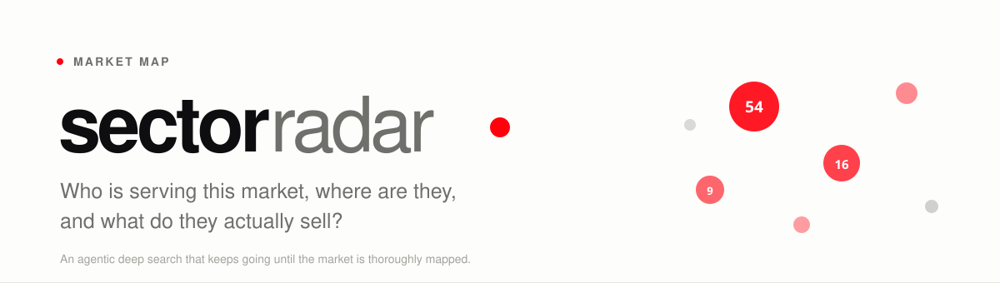
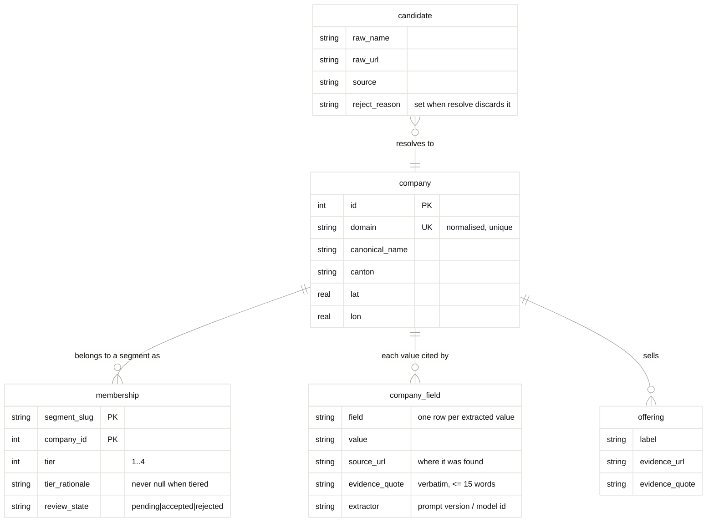

<picture>
  <source media="(prefers-color-scheme: dark)" srcset="docs/assets/banner-dark.svg">
  
</picture>

[](https://github.com/danielvogler/sectorradar/actions/workflows/ci.yml)
[](./LICENSE)
[](https://www.python.org/downloads/)
[](https://docs.astral.sh/uv/)
[](https://docs.astral.sh/ruff/)
[](https://mypy-lang.org/)
[](https://pre-commit.com/)
[](https://github.com/gitleaks/gitleaks)

---

## Start here

Clone it, then point your coding agent at **[AGENTS.md](./AGENTS.md)** and tell
it what market you want mapped.

```
Read AGENTS.md and set this up. I want to map digital marketing
agencies in Switzerland.
```

That file is written for exactly this. It walks an agent through the questions
worth asking before anything is configured, the setup, writing the segment
definition with you, running it cheaply first, and reading the coverage report
it produces. You do not need to know anything about the tool to start.

The rest of this page is what the agent is working from, and what to look at
once you have a result.

---

## What it does

Describe a market. It searches for the companies serving it, reads their
websites, and gives you a map, a filterable list, and a comparison of what
each of them actually sells.

**It keeps going until the sector is thoroughly mapped.** Each round counts how
many of the companies it found were ones you did not already have. While that
number stays high it writes new queries aimed at what the last round missed and
searches again; it stops once a round turns up almost nothing new, or when it
hits a limit you set — and it tells you which of those happened. On its first
run against a Swiss market it reached seven cantons that thirty hand-written
queries had never touched. How deep the search goes is not left to how long
anybody feels like looking.

**The result reads both ways.** *Looking for a supplier:* who does this work,
where, and which of them can show they have done it before. *Sizing up a field
you work in:* where it is crowded, where it is thin, and how your own
presentation compares — mark your own companies and they are held out of every
baseline, so you are measured against the field rather than an average you are
inside.

Open any company and you can see the quote from their own website behind every
line, with a link to the page it sits on. Anything the model could not point to
on a real page is discarded before it reaches you.

## Running it

```bash
make setup                     # venv, dependencies, git hooks, .env
```

Set `SECTORRADAR_CONTACT` in `.env` — the crawler refuses to start without a
real contact address, because every request it makes carries one. Then pick a
model provider and a search provider:

| | Options | Notes |
|---|---|---|
| `SECTORRADAR_LLM_PROVIDER` | `vertex` · `anthropic` · `openai` | All three do structured output natively, so the evidence guarantees hold whichever you pick |
| `SECTORRADAR_SEARCH_PROVIDER` | `vertex_grounding` · `anthropic` · `exa` · `brave` · `tavily` | The first two are models that search, and need no separate search key |

Install only the extra you use — `uv sync --extra anthropic`.

```bash
uv run sectorradar init
uv run sectorradar run --segment pilates-zurich
make serve                     # localhost:8080
```

Every run ends with a coverage report saying what it is probably missing.

---

## Pointing it at your own market

A segment is **one YAML file**. No code changes — if one is ever needed, the
abstraction is wrong and that is the bug.

Two are shipped, and both run as they stand:

| Segment | Asks | Size |
|---|---|---|
| [`pilates-zurich`](./segments/pilates-zurich.yaml) | Which studios teach Pilates in Zürich | Small — the one to try first |
| [`ai-assurance-ch`](./segments/ai-assurance-ch.yaml) | Who audits AI systems in Switzerland — model validation, LLM red-teaming, AI Act and FINMA model risk | ~190 candidates |

**Start with `pilates-zurich`.** It runs end to end in minutes on a market you
can check by eye — if it returns a physiotherapy practice or a gym in Bern you
will know at a glance, which is exactly what you want from a first run. It is
also a fair test of the hard parts: a real boundary problem (studios versus
gyms versus physiotherapy), sold almost entirely in German, where none of the
facet names appear on any page — `equipment` never matches *Reformer*.

```bash
make run    SEGMENT=pilates-zurich
make deepen SEGMENT=pilates-zurich   # search until it stops finding new companies
make serve  SEGMENT=pilates-zurich
```

`deepen` is the answer to "did we look hard enough". It repeats discovery,
writes new queries between rounds aimed at what the last round missed, and
stops once a round turns up almost nothing you did not already have — or when
it hits a limit you set, saying which. Left to a person or an agent, that
judgement gets made by boredom, and a half-searched market produces a dataset
that looks complete. On its first run against the segment above it found 143
companies in three rounds and reported honestly that it had stopped at the
limit rather than because there was nothing left to find.

The second is the more instructive one to read. "Who builds AI systems" is a
claim most firms make loudly; "who audits them" is narrow and easy to blur,
because every consultancy that has put *responsible AI* on a slide will look
like a candidate. So the boundary has to do real work:

```yaml
# segments/ai-assurance-ch.yaml — the parts that decide everything
inclusion: >
  Include a company if it offers, as a named service on its own website,
  independent evaluation, testing, auditing or assurance of AI systems:
  model validation, LLM red-teaming or adversarial testing, bias, fairness
  and robustness assessment, or EU AI Act and FINMA model-risk readiness.
  Exclude companies that only build or integrate AI systems, however
  carefully, and however much they mention responsible AI.
  Exclude general cybersecurity firms with no AI-specific testing service.
  Exclude companies with no Swiss presence.

# `value: [words that prove it]`. A tag survives only if its words appear on
# the page, so these decide whether a table has anything in it. Swiss
# assurance is sold in three languages and the vocabulary differs sharply:
# `red_teaming` will never match a page offering *Angriffssimulation*.
facets:
  service_type:
    model_validation: ["modellvalidierung", "model validation", "backtesting"]
    red_teaming: ["red team", "angriffssimulation", "adversarial", "jailbreak"]
    bias_testing: ["bias", "fairness", "diskriminierung", "équité"]
    ai_act: ["ai act", "ki-verordnung", "konformität", "conformité"]
    model_risk: ["model risk", "modellrisiko", "finma"]
  vertical: [finance, insurance, pharma, public_sector]   # a plain list is fine too

sources:
  websearch:
    enabled: true
    queries:                     # every language the market sells in, and by city
      - "Modellvalidierung Bank Schweiz Beratung"
      - "audit intelligence artificielle Suisse"
      - "LLM red teaming Switzerland"
      - "AI risk consulting Zug"
```

Seeds and the gold set are deliberately empty in both. A list of specific firms
is a research artefact rather than a market definition, and a gold set is worth
most when it comes from knowledge the tool does not have — the firm a client
mentioned considering, the one you lost a mandate to. Those go in
`<slug>.local.yaml`, which is gitignored.

### Several markets at once, and private ones

One database holds them all, and companies are shared between them — a firm
that turns up in two markets is crawled once, extracted once, and carries its
own tier and rationale in each. Everything segment-specific lives in
`membership`, so nothing bleeds across.

Each gets its own export and its own page:

```bash
uv run sectorradar run  --segment ai-assurance-ch
make serve SEGMENT=ai-assurance-ch      # this market only
make serve SEGMENT=pilates-zurich       # the other one
make audit SEGMENT=ai-assurance-ch      # per segment too
```

A segment file describes a market, which is the shareable part. Sometimes the
market you are mapping is itself the thing you would rather not announce — put
those in `segments/private/`, which is gitignored and searched after the shared
directory. A directory rather than a list of ignored filenames, because a
gitignore naming somebody's private segments tells you what they are.


```bash
make run    SEGMENT=ai-assurance-ch
make deepen SEGMENT=ai-assurance-ch   # search until it stops finding new companies
make serve  SEGMENT=ai-assurance-ch
```

`deepen` is the answer to "did we look hard enough". It repeats discovery,
writes new queries between rounds aimed at what the last round missed, and
stops once a round turns up almost nothing you did not already have — or when
it hits a limit you set, saying which. Left to a person or an agent, that
judgement gets made by boredom, and a half-searched market produces a dataset
that looks complete. On its first run against the segment above it found 143
companies in three rounds and reported honestly that it had stopped at the
limit rather than because there was nothing left to find.

Everything follows from that file: what gets searched, what counts as in, the
vocabulary the tables are built from, and the headline on the page.

> **Writing it is the whole job, and worth doing with help.**
> [segments/AGENTS.md](./segments/AGENTS.md) is a guide for a coding agent to
> work through with you — six questions to answer before any YAML is written,
> how to turn near-misses into exclusion rules, how to size a vocabulary, and
> how to supply evidence words in the languages the market sells in. Point an
> agent at it and say "digital marketing agencies in Switzerland".

### Three things that decide whether the result is any good

**The inclusion rule.** It goes verbatim into the classifier prompt. Most
disappointing results are a boundary written loosely, not a discovery problem —
and `sectorradar classify` re-runs without re-crawling, so fixing it is cheap.

**The evidence words.** A tag survives only if its words appear on the page.
`seo` will not match *Suchmaschinenoptimierung*. Watch `tags_ungrounded` in the
classify output: a large number means your vocabulary and the market's language
have come apart, and the tables will look emptier than the market is.

**The gold set.** Companies you already know belong. Recall against it is
reported every run, and "reached unaided" is the number that actually measures
discovery. Your own knowledge of the market is the best source there is — the
firms that come up whenever somebody asks who else does this.

---

## What each stage does

| Stage | What it does |
|---|---|
| `discover` | Runs each enabled source, tracking how many candidates are new per query |
| `deepen` | Repeats discovery, writing fresh queries each round, until it stops finding companies you do not already have |
| `resolve` | Normalises domains and names, dedupes candidates into companies |
| `fetch` | Politely crawls each company's own site, caching HTML, skipping unchanged pages |
| `extract` | LLM → a structured profile, every fact quoted from the page it was read on |
| `classify` | A tier, a written rationale, and facet tags grounded in the site's own words |
| `geocode` | Addresses → coordinates, cache-first, refusing implausible matches |
| `seo` | Search visibility measured from stored markup. No model, free to re-run |
| `audit` | What this dataset is probably missing, and what to do about it |
| `snapshot` | Freezes the set so "who is new" is answerable in three months |

Extraction records far more than a service list: reference projects and the
client industry behind each, clients named on the site, products as distinct
from services, training formats, technologies, cloud providers, hosting model,
certifications, press coverage, and what the site itself carries — prices, a
team page, a careers page. Those are the fields that make companies comparable
rather than merely listed.

---

## How it fits together

```mermaid
%%{init: {
  'theme': 'base',
  'themeVariables': {
    'fontFamily': 'ui-sans-serif, -apple-system, Segoe UI, Helvetica, Arial, sans-serif',
    'fontSize': '14px',
    'primaryColor': '#FFFFFF',
    'primaryTextColor': '#0E0E10',
    'primaryBorderColor': '#E5E4DE',
    'secondaryColor': '#F7F6F3',
    'tertiaryColor': '#FDFDFB',
    'lineColor': '#A3A39D',
    'textColor': '#0E0E10',
    'clusterBkg': '#FDFDFB',
    'clusterBorder': '#E5E4DE',
    'edgeLabelBackground': '#FDFDFB'
  }
} }%%
flowchart LR
    SRC["<b>discover</b><br/><span style='color:#6F6F6B'>search · job ads · directories<br/>registry · your seeds</span>"]
    PIPE["<b>resolve → fetch → extract</b><br/><span style='color:#6F6F6B'>dedupe, crawl, and quote<br/>every claim</span>"]
    JUDGE["<b>classify → geocode → seo</b><br/><span style='color:#6F6F6B'>tier, place, and measure<br/>each site</span>"]
    DB[("<b>data/radar.db</b>")]
    DOC["<b>one JSON document</b>"]
    WEB["<b>web/dist/</b><br/><span style='color:#6F6F6B'>static files,<br/>open from the filesystem</span>"]

    YAML["<b>segments/*.yaml</b><br/><span style='color:#6F6F6B'>the market definition</span>"]

    YAML -.-> SRC
    SRC --> PIPE --> JUDGE --> DB
    DB -- "export" --> DOC --> WEB

    style YAML fill:#FFF3F3,stroke:#FF000D,stroke-width:1px
    style DB fill:#F7F6F3,stroke:#0E0E10,stroke-width:1.5px
    style WEB fill:#FFFFFF,stroke:#0E0E10,stroke-width:1.5px
```



The pipeline writes SQLite and exports **one JSON document**; the front end
reads that document and nothing else. That is what makes `web/dist/` a folder
you can hand to somebody: no database, no Python, no call back to anything you
run. `tests/test_architecture.py` enforces both directions, because both fail
quietly — a page that reads SQLite works perfectly on the machine that has one
and breaks only for the person you sent it to.

The provenance model is the interesting part of the schema:



`company_field` is one row per extracted value rather than a wide table, so
when the interface claims a firm offers a service you can click through to the
sentence on their site that says so.

---

## Sharing the result

`make web` builds a folder of static files that opens in any browser with no
server and no Python installed.

For a team, publish it to Google Cloud Storage and grant access by email:

```bash
make bucket                             # uniform access, versioning, public access blocked
make bucket-grant EMAIL=them@example.com
make publish                            # dry run: prints what it would send
make publish EXECUTE=1
```

The dry run is the default deliberately — uploading to shared storage is
outward-facing and awkward to take back.

| | |
|---|---|
| `make bucket-status` | The bucket's settings, who can read it, what is published |
| `make bucket-revoke EMAIL=…` | Take read access away |
| `make bucket-destroy` | Delete the bucket and everything in it |

`bucket-destroy` names what will disappear and requires the bucket's own name
typed back — a y/N prompt gets answered reflexively and this deletes data. It
is recoverable in the sense that matters: the published dataset is reproducible
from your database with `make publish EXECUTE=1`.

A colleague then runs `make app`, which pulls the published dataset and opens
it locally — no database, no API keys, no crawl, and **no segment file**. That
last one matters: the market most worth sharing a result for is often one you
keep private, so the reader would have no config to hold. The published
document carries the market's own definition — name, inclusion rule, tiers,
vocabulary, queries — which is what lets it be read at all. `sectorradar pull`
with no `--segment` lists what the bucket holds.

Setting a reader up takes about five minutes and is written out in
[AGENTS.md](./AGENTS.md) §A8 — point them, or their coding agent, at it. All
you send is the project and the bucket. Object storage rather than a
managed database because the pipeline already produces the right artefact;
the reasoning is in [docs/operations.md](./docs/operations.md).

---

## Scope and limits

- Reads only publicly accessible web pages and open company registries.
- Respects `robots.txt`, rate-limits, and identifies itself with your contact
  address.
- **Stores no personal data.** Team pages contribute a headcount estimate and
  nothing else — never names, never contact details.
- Measures what a site controls in its own markup. Not backlinks, not
  authority, not actual rankings, which need an index this tool does not have.

It is a research tool that runs on your laptop. A fresh clone reproduces the
pipeline, not the dataset: search moves, sites change, models drift.
[DATA.md](./DATA.md) sets out which parts are reproducible and why the gold set,
not the row count, is the check that matters.

### Sources and attribution

| Source | Gives | Terms |
|---|---|---|
| [LINDAS](https://lindas.admin.ch/) SPARQL | Swiss registry: legal name, form, purpose, seat, UID | Open, "Provide-the-Source" — attribution required |
| Web search | Candidate company URLs | Provider's terms |
| Job ads | Early signal on firms staffing up for the work | Site's terms |
| Agency directories | Candidate domains, used as seeds only | Each site's own ToS — **your** responsibility |
| [swisstopo](https://api3.geo.admin.ch/) | Address → coordinates | Open data |
| [Nominatim](https://nominatim.org/) | Geocoding fallback | ODbL, 1 req/s |

---

## Going further

| | |
|---|---|
| [segments/AGENTS.md](./segments/AGENTS.md) | How to arrive at a good segment — the questions to ask first, turning near-misses into exclusion rules, sizing a vocabulary |
| [docs/adding-a-segment.md](./docs/adding-a-segment.md) | Field-by-field reference for the segment YAML, and what to do when a run disappoints |
| [docs/architecture.md](./docs/architecture.md) | Why it is shaped this way, and the decisions that look wrong until you know why |
| [docs/operations.md](./docs/operations.md) | Running it, cost control, re-running stages safely, and publishing to object storage |
| [DATA.md](./DATA.md) | Sources, terms, what a fresh clone reproduces and what it does not |
| [AGENTS.md](./AGENTS.md) | Helping somebody use the tool (§A) and changing the code (§B) |

## Development

```bash
make check                     # lint, types, tests, secrets — no database or keys needed
make verify                    # adds the data-dependent gates
```

`make check` must pass from a bare clone.

## Licence

Apache-2.0 — see [LICENSE](./LICENSE) and [NOTICE](./NOTICE).
