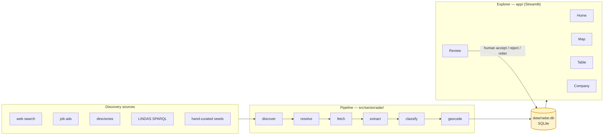

# sectorradar

**Who else is in this market, where are they, and what do they actually sell?**

[](https://github.com/danielvogler/sectorradar/actions/workflows/ci.yml)
[](./LICENSE)
[](https://www.python.org/downloads/)
[](https://github.com/astral-sh/ruff)
[](https://mypy-lang.org/)
[](https://pre-commit.com/)
[](https://github.com/gitleaks/gitleaks)

Turn a market segment into a structured, browsable dataset. `sectorradar`
gathers publicly available company information, organises it with source
citations, and serves it as a filterable table and map. Segments are defined in
YAML, so you can point it at any industry or country without touching code.

Every claim in the database carries the URL it came from and the sentence that
supports it. An unverifiable dataset about a market is worse than none.

<!-- Screenshot of the map view goes here once there is something real to capture. -->

## Scope and limitations

Read this first.

- Reads only publicly accessible web pages and open company registries.
- Respects `robots.txt` and rate-limits requests, identifying itself with a
  contact address you supply.
- Stores no personal data about individuals — team pages contribute headcount
  estimates only, never names or contact details.

It is a research tool, and it runs on your laptop. There is no cloud deployment,
no scheduler, and no multi-user mode.

## Architecture



The pipeline writes the SQLite file; the app reads it. That file is the only
interface between the two halves — the app never crawls, and never calls an LLM
on a rerun. The one arrow going back is the human review loop, which is a
first-class pipeline stage rather than an afterthought: at a few hundred rows you
can eyeball all of them, and that is the single biggest quality lever available.

The provenance model is the interesting part of the schema:

```mermaid
erDiagram
    company ||--o{ membership : "belongs to a segment as"
    company ||--o{ company_field : "each value cited by"
    company ||--o{ offering : "sells"
    candidate }o--|| company : "resolves to"

    company {
        int id PK
        string domain UK "normalised, unique"
        string canonical_name
        string canton
        real lat
        real lon
    }
    membership {
        string segment_slug PK
        int company_id PK
        int tier "1..4"
        string tier_rationale "never null when tiered"
        string review_state "pending|accepted|rejected"
    }
    company_field {
        string field "one row per extracted value"
        string value
        string source_url "where it was found"
        string evidence_quote "verbatim, <= 15 words"
        string extractor "prompt version / model id"
    }
    offering {
        string label
        string evidence_url
        string evidence_quote
    }
    candidate {
        string raw_name
        string raw_url
        string source
        string reject_reason "set when resolve discards it"
    }
```



`company_field` is one row per extracted value rather than a wide table, so when
the interface claims a firm runs GenAI workshops you can click through to the
sentence that says so.

## Quickstart

```bash
uv sync
```

```bash
cp .env.example .env   # set SECTORRADAR_CONTACT — the crawler refuses to run without it
```

```bash
uv run sectorradar init
```

```bash
uv run sectorradar run --segment agentic-ai-ch
```

```bash
uv run --extra app streamlit run app/Home.py
```

## Defining your own segment

A segment is one YAML file in `segments/`. No code changes.

```yaml
slug: agentic-ai-ch
name: Agentic AI & GenAI enablement providers, Switzerland
geo:
  country: CH
inclusion: >
  Include a company if it offers, as a named service on its own website,
  development of LLM agents for clients or GenAI training for organisations.
  Exclude pure product companies with no services arm.
tiers:
  1: "Agentic AI or GenAI services are the primary offering"
  2: "Broader AI consultancy that also ships agents"
enrich_tiers: [1, 2]
```

The `inclusion` prose is injected verbatim into the classifier prompt, which is
why the hard part of a new segment is writing a crisp boundary rather than
writing code. See [docs/adding-a-segment.md](./docs/adding-a-segment.md) for a
worked example.

## How it works

| Stage | What it does |
|---|---|
| `discover` | Runs each enabled source and records candidates, tracking how many are new per query |
| `resolve` | Normalises domains and names, then dedupes candidates into canonical companies |
| `fetch` | Politely crawls each company's own site, caching raw HTML and skipping unchanged pages |
| `extract` | Asks an LLM for a structured profile where every claim carries a verbatim quote |
| `classify` | Assigns a tier and a written rationale against the segment's inclusion rule |
| `geocode` | Turns addresses into coordinates, cache-first, only for companies worth mapping |
| `review` | Presents each company to a human to accept, reject or re-tier |
| `snapshot` | Freezes the accepted set so you can answer "who is new" three months later |

## Data sources and attribution

| Source | Gives | Terms |
|---|---|---|
| [LINDAS](https://lindas.admin.ch/) SPARQL | Swiss registry: legal name, form, purpose, seat, UID | Open, "Provide-the-Source" — attribution required |
| Web search | Candidate company URLs | Provider's terms |
| Job ads | Early signal on firms staffing up for the work | Site's terms |
| Agency directories | Candidate company domains, used as seeds only | Each site's own ToS — **your** responsibility |
| [swisstopo](https://api3.geo.admin.ch/) | Address → coordinates | Open data |
| [Nominatim](https://nominatim.org/) | Geocoding fallback | ODbL, 1 req/s |

Full detail, including why no sample database ships with this repository, is in
[DATA.md](./DATA.md).

## Development

```bash
uv run ruff check . && uv run ruff format --check . && uv run mypy && uv run pytest
```

`make check` runs the wider repo health check; `make verify` adds the
data-dependent acceptance gates. Contributor guidance is in
[AGENTS.md](./AGENTS.md) and [CONTRIBUTING.md](./CONTRIBUTING.md).

## Licence

Apache-2.0 — see [LICENSE](./LICENSE) and [NOTICE](./NOTICE).
