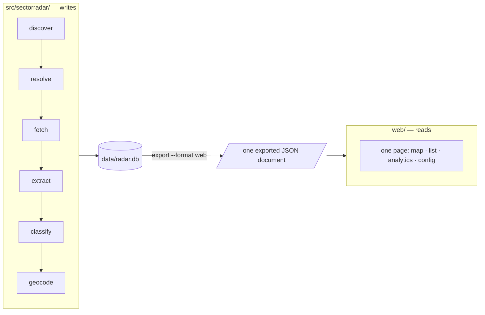

# Architecture

Why this is shaped the way it is. For what each knob does, see
[adding-a-segment.md](./adding-a-segment.md) and
[operations.md](./operations.md).

## The one decision everything else follows from

A market map is only worth having if you can check it. The interesting claim in
this dataset is never "here are 200 companies" — it is "this company offers
this service, and here is the sentence on its own site that says so". Strip the
evidence out and what remains is a list somebody could have guessed, with the
added danger that it looks authoritative.

So provenance is not a feature bolted on at the end. It determines the schema
(`company_field` is one row per extracted value, not a wide table), the
extraction contract (every claim carries a verbatim quote), and the validation
(a quote that is not found in the fetched text is dropped, and the drop rate is
reported).

## The two halves

The export is the only interface. The front end never crawls, never calls a
language model, and never opens the database.

This is not tidiness — it is the property that makes the output shareable.
`web/dist/` is a folder of static files. It opens from the filesystem, works
with no Python installed, and needs nothing running anywhere. A page that read
SQLite directly would still work perfectly on the machine that has the
database, and would break only for the person you sent it to. That failure
mode is invisible to the author, which is exactly why it is enforced rather
than agreed.

`tests/test_architecture.py` checks both directions. Nothing under `src/` may
import a view package, and nothing under `web/src/` may name a database file,
issue SQL, or make a network call. The Python side walks the syntax tree rather
than grepping, because a grep for an import is defeated by an aliased
or conditional import and produces false positives on the word appearing in a
comment. The page side uses anchored patterns for the same reason in reverse: a
bare search for `SELECT` matches every `<select>` element on the page.

A third rule rides along: the site imports exactly one data document. Two can
disagree about what is true.

### Why one front end and not two

There were two for a while — a Streamlit app for working with data as it
changed, and this build for sharing. The split cost more than it returned.
Every feature had to be built twice, and the Streamlit half's only real
advantage was reading the database live, which `make app` now removes by
exporting and rebuilding before it serves. The static build is the one that can
be handed to somebody, so it is the one that survived.

## The pipeline

Every stage is independently re-runnable and idempotent, reads and writes the
database, and holds no state in memory across a run. That property is what makes
`sectorradar run` interruptible: each stage commits before the next begins, so
Ctrl-C leaves a consistent database and re-running resumes rather than
restarting.

### discover

Runs each enabled source and writes `candidate` rows plus a `discovery_run` row
carrying `new_unique_n` — how many results that query produced that nothing had
seen before. Raw result counts tell you nothing; the new-unique rate is what
says whether a channel is exhausted. When it collapses, the answer is to switch
channel, not to rephrase the query.

Sources share one interface and live in a registry, so adding a channel is a
module and one line, never a change to `discover.py`. A source that throws is
caught, recorded on its `discovery_run` row, and the run continues — one
rate-limited channel must not discard what the others already found.

### resolve

The stage that decides whether the project works, and the one that will consume
the most time. Discovery producing duplicates is expected and fine. The
database silently containing the same firm three times, or silently merging two
firms that are not the same, is what makes the output worthless.

Order of operations:

1. **Normalise the domain.** Strip scheme, `www.`, path, query. Reject hosts
   that are never a company's own site — a LinkedIn page is not a website, and
   two firms sharing a Medium URL are not one firm.
2. **Normalise the name.** Strip *trailing* legal-form tokens only, so "Sagl"
   is a legal form but "Sagler" is a surname.
3. **Exact domain match merges.** One website is one company.
4. **Fuzzy name match flags, never merges.**
5. **Everything else is a new company.**

Step 4 is the important one. Auto-merging on name similarity is how a real
provider quietly disappears from the map, and nobody notices because the
absence looks like an absence. A near-match instead lands in the review queue
with a note naming the suspected duplicate.

The first segment was Swiss, and these specifics drove the design. They are
listed because each one generalises: every country has legal-form suffixes,
most have more than one spelling of the same place, and all of them have a
registry that disagrees with a website. Each has a test.

- The same firm registered as GmbH in Zug, AG in Zürich, Sàrl in Vaud.
- Umlaut spellings: `Zürich` / `Zuerich` / `Zurich`. Three foldings are
  generated per name — expanded, accent-stripped, and digraph-reduced — because
  no two of them alone make all three spellings meet.
- DE/FR/IT names for one registered entity. These never fuzzy-match; the domain
  is what unites them.
- A holding and its operating company on one website. They merge, because
  domain is the unique key. That is a deliberate loss of information — the thing
  being mapped is the business you can buy from, not the legal structure — and
  it is asserted in a test rather than left to chance.

### fetch

Politeness is a constraint on the code: `robots.txt` obeyed, one request per
second per host, a User-Agent carrying a real contact address, and a refusal to
run at all if `SECTORRADAR_CONTACT` is unset. A 403 or a bot-block page means
back off and record it. There is no workaround and building one is out of scope.

Raw HTML goes to `data/raw/<sha256>.html` with the content hash on the `page`
row. An unchanged page costs nothing to reprocess, which is what makes re-runs
cheap enough to do often — and a pipeline that is expensive to re-run stops
being re-run.

### extract

One LLM call per company over the cleaned page text, returning a validated
`CompanyProfile`.

A model reading generic marketing copy will confidently produce a plausible
service list the page does not support, and the failure is silent: a fabricated
profile looks exactly like a good one. The prompt argues against this — `null`
is framed as the correct answer, and inference from company names, logo walls
and partner badges is forbidden — but argument is not a guarantee.

The guarantee is mechanical. Every quote must be found in the text the model was
given, compared with whitespace and case normalised so that reflowing is not
mistaken for invention. Anything else must match exactly, which is what stops
two distant fragments being stitched into a claim the page never made. Claims
that fail are dropped and counted, and the resulting `hallucination_rate` is the
signal that a prompt or model change has made things worse.

Prompts are versioned. `company_field.extractor` records
`<prompt-version>/<model-id>`, so a re-run under a new prompt is
distinguishable from the old one instead of silently overwriting it.

Personal data is refused twice: the prompt forbids it, and the code strips
contact details and drops any offering whose evidence quote contains one. A
legal constraint should not rest on a model choosing to comply.

### classify

Separate from extraction, because tiering depends on the segment definition
while extraction does not. The same extracted profile serves any number of
segments, and the inclusion rule — the thing that actually gets iterated on —
can be revised and re-applied without re-crawling anything.

The segment's `inclusion` prose and `tiers` map go into the prompt verbatim.
Paraphrasing them in code would put the boundary in two places, where it would
drift.

Reviewed rows are skipped. A human who accepted or re-tiered a company has made
the authoritative decision, and quietly overwriting it on the next run is how an
hour of review evaporates with nothing to show for it.

### geocode

Cache-first, including negative results: a place not found this morning will not
be found this afternoon, and re-asking is exactly the pointless traffic the
cache exists to prevent. swisstopo first because the segment is Swiss, Nominatim
as fallback at its published one request per second.

### review

A pipeline stage that happens to have a user interface. At a few hundred rows a
human can look at all of them, and that is a bigger quality lever than any
amount of prompt tuning. The page is built for speed: one company at a time,
every claim beside the sentence and link behind it, one click per decision.

## Storage

SQLite, one file, because the target scale is 100–2000 rows. Postgres, PostGIS
and pgvector would all be defensible at 10 million and are unjustifiable here.

Two structural choices are worth the space they cost:

**`company_field` is one row per extracted value**, each with a source URL,
evidence quote, confidence, extractor version and timestamp. A wide table would
be smaller and faster and would make the central promise — click through to the
sentence — impossible.

**`snapshot` freezes the reviewed set as JSON.** The interesting question in
month three is "who is new, who repositioned", and that cannot be reconstructed
from a mutable table afterwards. It has to be captured at the time.

Migrations are an ordered list of DDL steps behind a `schema_version` table, in
`db.py`. Not Alembic: one file and a dependency-free upgrade path is the right
weight for a project of this size.

## Genericity

A segment is a YAML file validated into a pydantic `Segment` on load, and an
invalid one fails at CLI start naming the offending field rather than halfway
through a twenty-minute crawl.

`segments/pilates-zurich.yaml` is the proof that this works: a second,
genuinely different segment — different inclusion rule, different tiers,
different facets — added with no change to any module under `src/`. If a new
segment ever needs code, the abstraction is wrong and the abstraction is what to
fix.

## What this deliberately is not

No cloud deployment, no Postgres, no scheduler, no multi-user auth, no outreach
or CRM features, and no contact-person data. Cloud Run plus Cloud SQL is a
plausible v2, and the pipeline ↔ export split means lifting the pipeline into a
container and repointing the app at a hosted database would not require a
rewrite. That is the extent of the accommodation: designed so it would not
hurt, not built now.

## Decisions that look wrong until you know why

Every entry here was a bug once. Each now looks like an oversight, an
inconsistency, or a line worth deleting — and each is load-bearing. The
measurements are from real runs, kept because the magnitude is the argument.

**Crawling**

1. **Footers are not stripped.** They are boilerplate everywhere except where
   it matters: in several jurisdictions the registered address appears only in
   the footer or the imprint. Stripping them lost every address in a measured
   sample.
2. **Imprint and contact paths are crawled explicitly.** Without a street, every
   company in a city geocodes to the same point, and no amount of zooming
   separates markers that are genuinely identical.

**Extraction**

3. **`MAX_EVIDENCE_CHARS` is far above what the prompt asks for.** Pydantic
   validates a profile as a unit, so one over-long quote failed the whole
   model — nine of the first fifteen companies lost every claim. Losing one
   claim to a rule is reasonable; losing the company is not.
4. **`tier` is a bounded `int`, not a `Literal`.** Some providers' structured
   output rejects integer enums outright, and every classification call fails
   with a schema error that names nothing useful.
5. **Every stage commits per company.** An interrupted run used to discard
   everything: a crawl left 35 files on disk and no rows in the table.
6. **Attribute lists are stored, not just extracted.** Technologies,
   certifications and the rest were returned by the model and written nowhere
   for weeks — the interface showed a company as having none while the
   pipeline had read them off the page and dropped them.

**Vocabulary**

7. **Facet values are matched on word boundaries, never substrings.** A
   three-letter value was applied to 148 companies of which roughly 20
   genuinely matched: it is a substring of several ordinary English and German
   words that appear in most marketing copy.
8. **Industry names are refused when unrecognised, not passed through.** Free
   text produced 82 values for what is about 23 sectors — the same sector in
   three casings, two languages and with a hyphen. A vocabulary with a hole in
   it is not a vocabulary.
9. **A facet needs its evidence words, and they are market-specific.** A value
   only survives if its words appear on the page, so a vocabulary declared
   without them is silently narrowed rather than applied. Adding a value
   without evidence words makes a table emptier, not fuller.
10. **A vocabulary that is too small is as bad as one too large.** Seven
    service types put half a market in one value. Fifteen to twenty-five is
    usually where two competitors come out different.

**Geography**

11. **`geocode_status` exists because a null coordinate means two things** —
    "looked and failed" and "never looked". Conflating them excluded 21 real,
    correctly-located companies as foreign.
12. **The geocoder's answer is checked against the question.** Fuzzy matching
    will happily return a village whose name resembles a foreign city, and
    place a company a thousand kilometres from its office.

**Classification**

13. **A null tier means "excluded", not "not yet done".** The report called
    these *undecided*, and the interface duly displayed them as companies —
    which made a map look like it was missing a third of its addresses when it
    was showing candidates that had been deliberately rejected.
14. **`upsert_membership` guards on `review_state`.** A re-classification used
    to overwrite human decisions through a `COALESCE`.
15. **Aggregates exclude two different sets for two different reasons.** The
    operator's own companies, because a baseline you are inside tells you that
    you are average; and rejected candidates, because they are not in the
    market. With only the first, a location breakdown reported four times as
    many unknown locations as the segment had companies.

**Scoring**

16. **Self-published coverage scores zero.** It is the one component a company
    cannot manufacture by editing its own website, which is what makes it worth
    the most — and what makes counting a press release alongside it worthless.
17. **A mention on the company's own domain naming no outlet is a blog post.**
    Unfiltered, this produced 75 "press mentions" that were all the companies'
    own news pages, and a coverage score that measured nothing.

**The built page**

18. **The build ends with `web/scripts/relativise.mjs`.** Astro emits absolute
    asset paths whatever `base` is set to. An absolute path works perfectly
    over HTTP and breaks when the folder is opened as a file — so it is
    invisible to whoever built it and broken for whoever received it.
19. **Serve with `scripts/serve.py`, not `http.server`.** The latter sends no
    cache headers and browsers cache anyway. The exported data is compiled into
    the page, so a cached page is stale *data*, and bugs get reported against
    output that was replaced twenty minutes earlier.
20. **Leaflet measures its container once, at construction.** In a grid that
    settles afterwards it builds against a box that no longer exists and paints
    nothing. `invalidateSize` after layout, plus a `ResizeObserver`.
21. **No two elements share an id.** A nav anchor collided with the map
    container, `getElementById` returned the section, and the map silently
    rendered into a full-width band.

**The tests themselves**

22. **Boundary checks use anchored patterns, not substrings.** A bare search
    for `SELECT` matches every `<select>` element on a page, and a check that
    cries wolf on its own markup is deleted the first time it blocks a commit.
23. **A test asserts the artefact, not the intention.** One asserted that a
    config file contained a particular setting, and passed for weeks while the
    output that setting was supposed to produce was wrong.

## Deliberately absent

- **No review interface.** `review_state` and the classifier's refusal to
  overwrite a non-pending decision both remain, so a reviewed tier is safe. A
  queue of several hundred companies nobody was going to work through is worse
  than no queue at all.
- **No backlink, authority or ranking data.** `seo.py` measures only what a
  site controls in its own markup. Anything else needs an index this tool does
  not have, and a proxy for it would look like the thing without being it.
- **No personal data.** Team pages contribute a headcount estimate and nothing
  else. Enforced in `extract.py` and re-checked by `scripts/verify_data.py`.
- **No cloud database.** See `docs/operations.md` for why GCS rather than Cloud
  SQL or BigQuery.
