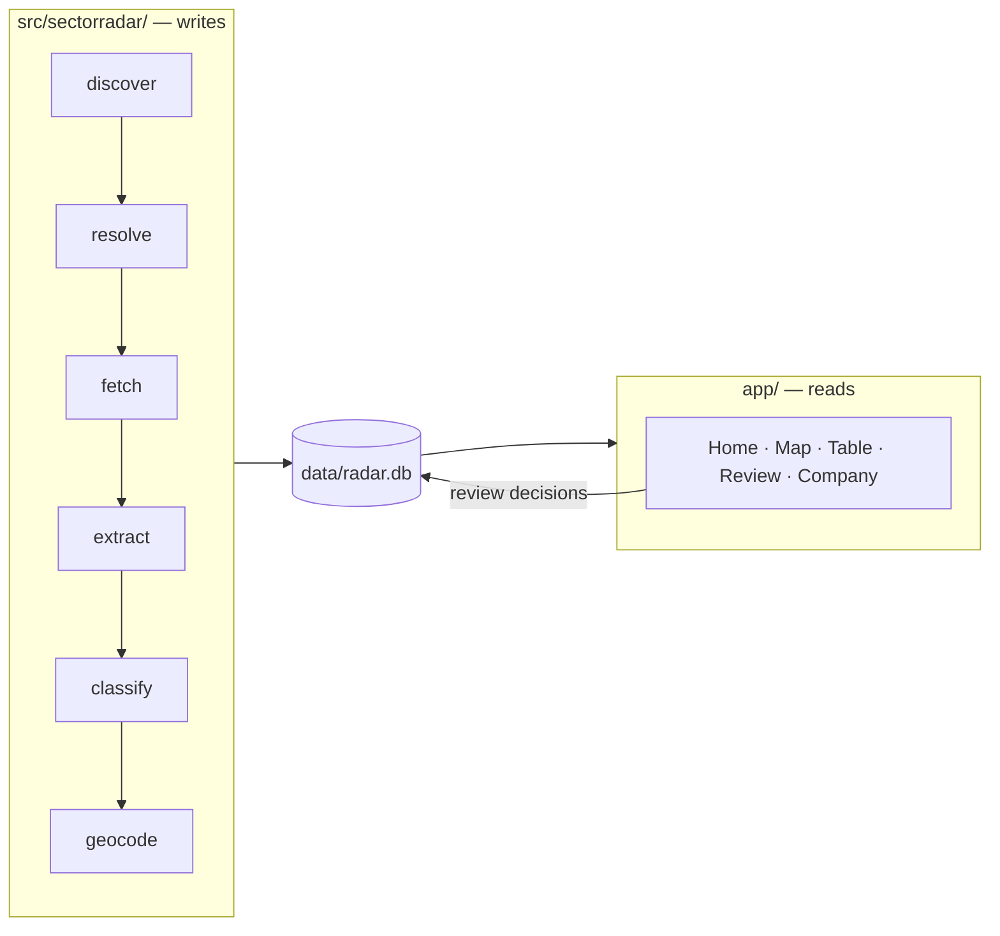

# Architecture

Why this is shaped the way it is. For what each knob does, see
[adding-a-segment.md](./adding-a-segment.md) and
[operations.md](./operations.md).

## The one decision everything else follows from

A market map is only worth having if you can check it. The interesting claim in
this dataset is never "here are 200 companies" — it is "this company sells
agent development, and here is the sentence on their own site that says so".
Strip the evidence out and what remains is a list somebody could have guessed,
with the added danger that it looks authoritative.

So provenance is not a feature bolted on at the end. It determines the schema
(`company_field` is one row per extracted value, not a wide table), the
extraction contract (every claim carries a verbatim quote), and the validation
(a quote that is not found in the fetched text is dropped, and the drop rate is
reported).

## The two halves

`data/radar.db` is the only interface. The app never crawls and never calls a
language model.

This is not tidiness. Streamlit re-executes the entire page script on every
widget interaction — every checkbox tick, every dropdown change. Anything
expensive on the read path is therefore paid repeatedly, at human-interaction
frequency, and the app becomes unusable somewhere around a few hundred rows. A
crawl or an LLM call on that path would be catastrophic rather than merely slow.

The rule is enforced mechanically, not by convention:
`tests/test_architecture.py` walks the AST of every file under both trees and
fails if `app/` imports `sectorradar` or if anything under `src/` imports
`streamlit`. It walks the syntax tree rather than grepping because a grep for
`import streamlit` is defeated by an aliased or conditional import and produces
false positives on the word appearing in a comment.

A second rule rides along: all SQL lives in `app/lib/queries.py`. That one
caught a real violation during the build — the Review page had grown its own
`UPDATE` statement.

## The pipeline

Every stage is independently re-runnable and idempotent, reads and writes the
database, and holds no state in memory across a run. That property is what makes
`sectorradar run` interruptible: each stage commits before the next begins, so
Ctrl-C leaves a consistent database and re-running resumes rather than
restarting.

### discover

Runs each enabled source and writes `candidate` rows plus a `discovery_run` row
carrying `new_unique_n` — how many results that query produced that nothing had
seen before. Raw result counts tell you nothing; the new-unique rate is what
says whether a channel is exhausted. When it collapses, the answer is to switch
channel, not to rephrase the query.

Sources share one interface and live in a registry, so adding a channel is a
module and one line, never a change to `discover.py`. A source that throws is
caught, recorded on its `discovery_run` row, and the run continues — one
rate-limited channel must not discard what the others already found.

### resolve

The stage that decides whether the project works, and the one that will consume
the most time. Discovery producing duplicates is expected and fine. The
database silently containing the same firm three times, or silently merging two
firms that are not the same, is what makes the output worthless.

Order of operations:

1. **Normalise the domain.** Strip scheme, `www.`, path, query. Reject hosts
   that are never a company's own site — a LinkedIn page is not a website, and
   two firms sharing a Medium URL are not one firm.
2. **Normalise the name.** Strip *trailing* legal-form tokens only, so "Sagl"
   is a legal form but "Sagler" is a surname.
3. **Exact domain match merges.** One website is one company.
4. **Fuzzy name match flags, never merges.**
5. **Everything else is a new company.**

Step 4 is the important one. Auto-merging on name similarity is how a real
competitor quietly disappears from the map, and nobody notices because the
absence looks like an absence. A near-match instead lands in the review queue
with a note naming the suspected duplicate.

Swiss specifics that drove the design, each with a test:

- The same firm registered as GmbH in Zug, AG in Zürich, Sàrl in Vaud.
- Umlaut spellings: `Zürich` / `Zuerich` / `Zurich`. Three foldings are
  generated per name — expanded, accent-stripped, and digraph-reduced — because
  no two of them alone make all three spellings meet.
- DE/FR/IT names for one registered entity. These never fuzzy-match; the domain
  is what unites them.
- A holding and its operating company on one website. They merge, because
  domain is the unique key. That is a deliberate loss of information — the thing
  being mapped is the business you can buy from, not the legal structure — and
  it is asserted in a test rather than left to chance.

### fetch

Politeness is a constraint on the code: `robots.txt` obeyed, one request per
second per host, a User-Agent carrying a real contact address, and a refusal to
run at all if `SECTORRADAR_CONTACT` is unset. A 403 or a bot-block page means
back off and record it. There is no workaround and building one is out of scope.

Raw HTML goes to `data/raw/<sha256>.html` with the content hash on the `page`
row. An unchanged page costs nothing to reprocess, which is what makes re-runs
cheap enough to do often — and a pipeline that is expensive to re-run stops
being re-run.

### extract

One LLM call per company over the cleaned page text, returning a validated
`CompanyProfile`.

A model reading generic marketing copy will confidently produce a plausible
service list the page does not support, and the failure is silent: a fabricated
profile looks exactly like a good one. The prompt argues against this — `null`
is framed as the correct answer, and inference from company names, logo walls
and partner badges is forbidden — but argument is not a guarantee.

The guarantee is mechanical. Every quote must be found in the text the model was
given, compared with whitespace and case normalised so that reflowing is not
mistaken for invention. Anything else must match exactly, which is what stops
two distant fragments being stitched into a claim the page never made. Claims
that fail are dropped and counted, and the resulting `hallucination_rate` is the
signal that a prompt or model change has made things worse.

Prompts are versioned. `company_field.extractor` records
`<prompt-version>/<model-id>`, so a re-run under a new prompt is
distinguishable from the old one instead of silently overwriting it.

Personal data is refused twice: the prompt forbids it, and the code strips
contact details and drops any offering whose evidence quote contains one. A
legal constraint should not rest on a model choosing to comply.

### classify

Separate from extraction, because tiering depends on the segment definition
while extraction does not. The same extracted profile serves any number of
segments, and the inclusion rule — the thing that actually gets iterated on —
can be revised and re-applied without re-crawling anything.

The segment's `inclusion` prose and `tiers` map go into the prompt verbatim.
Paraphrasing them in code would put the boundary in two places, where it would
drift.

Reviewed rows are skipped. A human who accepted or re-tiered a company has made
the authoritative decision, and quietly overwriting it on the next run is how an
hour of review evaporates with nothing to show for it.

### geocode

Cache-first, including negative results: a place not found this morning will not
be found this afternoon, and re-asking is exactly the pointless traffic the
cache exists to prevent. swisstopo first because the segment is Swiss, Nominatim
as fallback at its published one request per second.

### review

A pipeline stage that happens to have a user interface. At a few hundred rows a
human can look at all of them, and that is a bigger quality lever than any
amount of prompt tuning. The page is built for speed: one company at a time,
every claim beside the sentence and link behind it, one click per decision.

## Storage

SQLite, one file, because the target scale is 100–2000 rows. Postgres, PostGIS
and pgvector would all be defensible at 10 million and are unjustifiable here.

Two structural choices are worth the space they cost:

**`company_field` is one row per extracted value**, each with a source URL,
evidence quote, confidence, extractor version and timestamp. A wide table would
be smaller and faster and would make the central promise — click through to the
sentence — impossible.

**`snapshot` freezes the reviewed set as JSON.** The interesting question in
month three is "who is new, who repositioned", and that cannot be reconstructed
from a mutable table afterwards. It has to be captured at the time.

Migrations are an ordered list of DDL steps behind a `schema_version` table, in
`db.py`. Not Alembic: one file and a dependency-free upgrade path is the right
weight for a project of this size.

## Genericity

A segment is a YAML file validated into a pydantic `Segment` on load, and an
invalid one fails at CLI start naming the offending field rather than halfway
through a twenty-minute crawl.

`segments/genai-training-ch.yaml` is the proof that this works: a second,
genuinely different segment — different inclusion rule, different tiers,
different facets — added with no change to any module under `src/`. If a new
segment ever needs code, the abstraction is wrong and the abstraction is what to
fix.

## What this deliberately is not

No cloud deployment, no Postgres, no scheduler, no multi-user auth, no outreach
or CRM features, and no contact-person data. Cloud Run plus Cloud SQL is a
plausible v2, and the `src/` ↔ `app/` split means lifting the pipeline into a
container and repointing the app at a hosted database would not require a
rewrite. That is the extent of the accommodation: designed so it would not
hurt, not built now.
